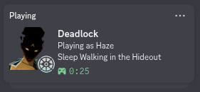

# Deadlock RPC

Discord Rich Presence for Deadlock — automatically shows your current hero, game state, and match mode on your Discord profile in real time.

> **Not affiliated with Valve Corporation or the Deadlock development team.** This is an independent, open-source project.

---

## Preview



---

## Features

- **Hero display** — shows your current hero's name and card image
- **Game state tracking** — Hideout, In Queue, Match Intro, In Match, Post Match, Spectating
- **Match mode detection** — Standard Match, Street Brawl, Bot Match, Training Range, and more
- **Hero-specific hideout messages** — unique status text per hero while in the Hideout
- **Live elapsed timer** — tracks how long you have been in-session
- **Auto-launch** — launches Deadlock with the required flag automatically
- **Self-installing** — creates a desktop shortcut on first run, no extra steps needed
- **Auto-exit** — closes itself when you close Deadlock

---

## How It Works

Deadlock can write its internal console output to a log file when launched with the `-condebug` flag. Deadlock RPC monitors this file in real time, parsing log lines with regex patterns to detect:

- Hero selection and changes
- Map loads and game phase transitions
- Match mode (player count, bot presence, map name)
- Game shutdown and session end

When state changes are detected, the Discord presence is updated via Discord's IPC protocol. No game memory is read, no files are modified, and no network traffic is intercepted — the app is entirely read-only with respect to the game.

---

## Efficiency & FPS Impact

Deadlock RPC is built in **Rust**, chosen specifically for its minimal runtime overhead and zero garbage collection pauses. The application:

- Reads only the **tail of the log file** — it does not load the entire file into memory
- Polls for changes every **500ms** using standard file I/O, not filesystem watchers
- Updates Discord presence only when **state actually changes** — no redundant IPC calls
- Runs entirely in the **background** with negligible CPU and memory usage
- Has **no impact on game performance or FPS** — it operates independently of the game process

---

## Installation

### Requirements

- **Discord** must be running

### Steps

1. Go to the [Releases](../../releases) page
2. Download and extract the zip for your platform:
   - **Windows:** `deadlock-rpc-setup-windows-x86_64.zip`
   - **Linux:** `deadlock-rpc-setup-linux-x86_64.zip`
3. Run the binary inside the extracted folder once:
   - **Windows:** double-click `deadlock-rpc.exe`
   - **Linux:** `chmod +x deadlock-rpc && ./deadlock-rpc`
4. A desktop shortcut named **Deadlock RPC** is created automatically
5. Deadlock launches immediately with Rich Presence active

From this point forward, use the **Deadlock RPC** shortcut instead of launching Deadlock directly.

> **Keep the extracted folder intact.** Logs are written to the `logs/` folder inside it.

### Flags

| Flag | Description |
|------|-------------|
| `--no-launch` | Start the RPC monitor without launching Deadlock |

---

## Manual Launch Option (`-condebug`)

Deadlock RPC automatically launches Deadlock with the required `-condebug` flag. If you prefer to manage Deadlock's launch options yourself — for example, if you launch through a different shortcut — you can set the flag directly in Steam:

1. Open **Steam** and go to your **Library**
2. Right-click **Deadlock** and select **Properties**
3. Under the **General** tab, find the **Launch Options** field
4. Enter `-condebug` (you can combine it with any existing options, e.g. `-condebug -novid`)
5. Close the Properties window

Once set, you can launch Deadlock normally and then run Deadlock RPC with the `--no-launch` flag to skip the automatic launch:

```
./deadlock-rpc --no-launch
```

---

## Building from Source

Requires [Rust](https://rustup.rs) stable.

```bash
git clone https://github.com/tariq-swe/deadlock-rpc.git
cd deadlock-rpc
cargo build --release
./target/release/deadlock-rpc
```

---

## Contributing

Contributions are welcome. Please follow these guidelines:

- **Open an issue first** for non-trivial changes to align on approach before writing code
- **Keep PRs focused** — one feature or fix per pull request
- **No breaking changes** to existing CLI flags without discussion
- **Test manually** against a running Deadlock session where possible
- Code is formatted with `cargo fmt` and linted with `cargo clippy`

Bug reports with the contents of `logs/deadlock-rpc.log` are especially helpful for diagnosing state detection issues.

---

## Disclaimer

This project is not affiliated with, endorsed by, or connected to Valve Corporation or the Deadlock development team in any way.

**Deadlock**, the Deadlock logo, all hero names, hero images, and all related in-game assets are the property of **Valve Corporation**. All rights reserved.

Hero images and game data displayed in the Discord presence are sourced from the community-maintained [Deadlock API](https://deadlock-api.com) and are the intellectual property of Valve Corporation. They are used here solely for non-commercial, informational display within Discord Rich Presence and remain the property of their respective owners.

This project does not distribute, modify, or claim ownership of any Valve assets. If you are a rights holder and have concerns, please open an issue and they will be addressed promptly.